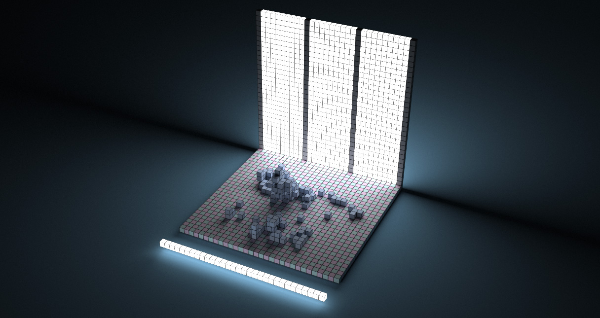

# <a name="title">Taichi Voxel Challenge</a>

<p align="center">
</img>
</p>

> Figure: result of `python3 example6.py`. Please replace the image above (`demo.jpg`) with yours, so that other people can immediately see your results :-)

We invite you to create your voxel artwork, by putting your [Taichi](https://github.com/taichi-dev/taichi) code in `main.py`!

Rules:

+ You can only import two modules: `taichi` (`pip` installation guide below) and `scene.py` (in the repo).
+ The code in `main.py` cannot exceed 99 lines. Each line cannot exceed 120 characters.

The available APIs are:

+ `scene = Scene(voxel_edges, exposure)`
+ `scene.set_voxel(voxel_id, material, color)`
+ `material, color = scene.get_voxel(voxel_id)`
+ `scene.set_floor(height, color)`
+ `scene.set_directional_light(dir, noise, color)`
+ `scene.set_background_color(color)`

Remember to call `scene.finish()` at last.

**Taichi Lang documentation:** https://docs.taichi-lang.org/

**Modifying files other than `main.py` is not allowed.**


## Installation

Make sure your `pip` is up-to-date:

```bash
pip3 install pip --upgrade
```

Assume you have a Python 3 environment, simply run:

```bash
pip3 install -r requirements.txt
```

to install the dependencies of the voxel renderer.

## Quickstart

```sh
python3 example1.py  # example2/3/.../7/8.py
```

Mouse and keyboard interface:

+ Drag with your left mouse button to rotate the camera.
+ Press `W/A/S/D/Q/E` to move the camera.
+ Press `P` to save a screenshot.

## More examples

<a href="https://github.com/raybobo/taichi-voxel-challenge"></img></a>  <a href="https://github.com/victoriacity/voxel-challenge"></img></a> 
<a href="https://github.com/yuanming-hu/voxel-art"></img></a> <a href="https://github.com/neozhaoliang/voxel-challenge"></img></a> 
<a href="https://github.com/maajor/maajor-voxel-challenge"></img></a>  <a href="https://github.com/rexwangcc/taichi-voxel-challenge"></img></a> 
<a href="https://github.com/houkensjtu/qbao_voxel_art"></img></a>  <a href="https://github.com/ltt1598/voxel-challenge"></img></a> 

## Show your artwork 

Please put your artwork at the beginning of this README file. Replacing the `demo.jpg` file with your creation will do the job.
